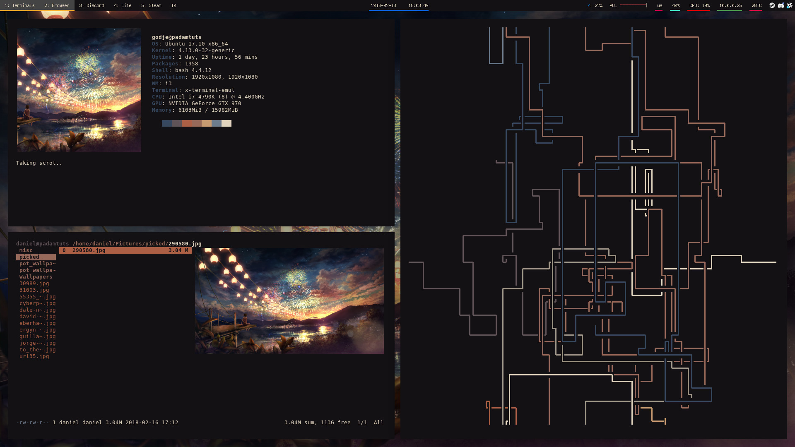

# Dotfiles
of Daniel Mayovskiy

* * * 

This is a repository where I keep my dotfiles. I have them symlinked on my Linux from this folder.

My .vimrc has comments so you can copy some of the config for yourself if you want.

## My current rice

You can find **polybar** and **neofetch** config in `.config` folder.
