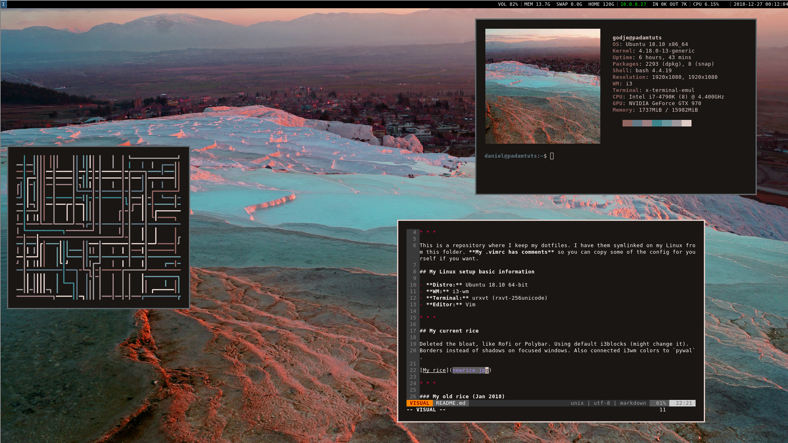
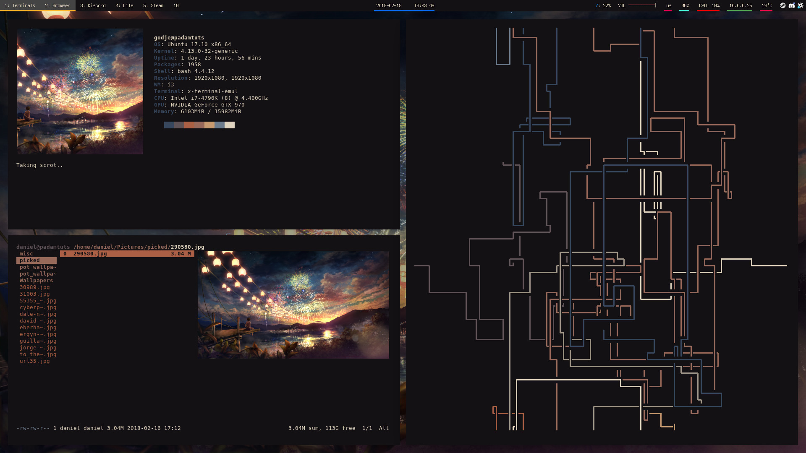

# Dotfiles / Linux Config
of Daniel Mayovskiy (PaDamTuts)

* * * 

This is a repository where I keep my dotfiles. I have them symlinked on my Linux from this folder. **My .vimrc has comments** so you can copy some of the config for yourself if you want.

## My Linux setup basic information

- **Distro:** Ubuntu 18.10 64-bit
- **WM:** i3-wm
- **Terminal:** urxvt (rxvt-256unicode)
- **Editor:** Vim

* * *

## My current rice

Deleted the bloat, like Rofi or Polybar. Using default i3blocks (might change it).
Borders instead of shadows on focused windows. Also connected i3wm colors to `pywal`.

 

* * *

### My old rice (Jan 2018)

 

You can find **polybar** and **neofetch** config in `.config` folder.

Polybar was built with an older version of xcb-proto, because the newer xcb-proto break the build. You have to purge xcb-proto, download and install an older xcb-proto manually. Version 11 worked for me.

## some comments

`_vimrc` is for Windows. `.vimrc` is for Unix
